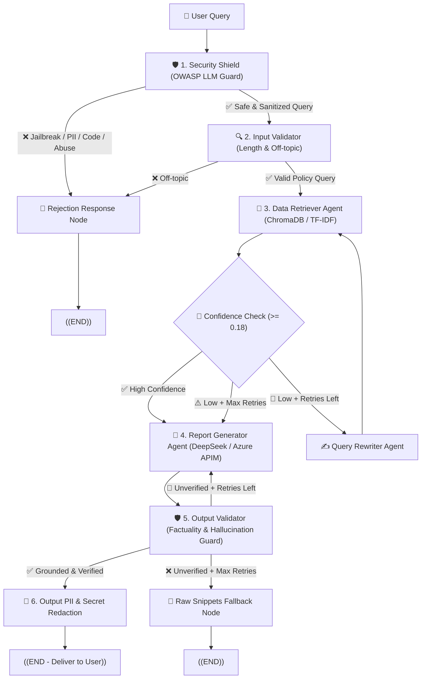

# Bangkok Bank (BBL) — Agentic RAG Policy Assistant

[](https://github.com/bangkokbank/rag-bbl/actions/workflows/ci.yml)
[](tests/)
[](tests/)
[](https://www.python.org/downloads/release/python-3110/)
[](docker-compose.yml)

<p align="left">
  
  
  
  
  
  
  
  
  
  
  
  
  
</p>

Multi-agent RAG system for answering corporate policy questions (HR, IT Security, Operations). Built on **LangGraph** with **ChromaDB** vector search and **DeepSeek / Azure APIM** as the LLM backend. Supports Thai and English.

---

## System Architecture



---

## Features

### Multi-Agent Pipeline (LangGraph)
- **Data Retriever** — pulls policy snippets from `knowledge_base.txt` and scores similarity confidence.
- **Report Generator** — produces a structured 4-section answer with inline citations, auto-detecting Thai/English.
- **Query Rewriter** — rewrites the query and retries when confidence is low.
- **Fallback** — if hallucination checks keep failing, returns the raw verified snippets instead of guessing.

### Two-Stage Retrieval (`tools/search.py`)
- **Stage 1 (recall):** ChromaDB dense vectors (`multilingual-e5-small`) + TF-IDF, merged with Reciprocal Rank Fusion.
- **Stage 2 (precision):** Cross-Encoder re-ranking with `BAAI/bge-reranker-v2-m3`, scores normalized via sigmoid.
- Synonym mapping for colloquial terms (*WFH* → *remote work*, *ลาพักร้อน* → *annual leave*, etc.)

### Security (OWASP LLM Top 10)
- **Jailbreak guard** — catches adversarial prompts like *"Ignore previous instructions"*, *"DAN Mode"*, *"ลืมกฎทั้งหมด"*.
- **Prompt leakage defense** — blocks attempts to extract system prompts or internal config.
- **PII redaction** — masks Thai National IDs, credit card numbers, phone numbers, emails, and API keys on both input and output.
- **Injection filtering** — strips `<script>` tags, SQL injection (`DROP TABLE`, `UNION SELECT`), and shell payloads.
- **Rate limiting** — sliding window, 30 requests/minute per session.
- **Profanity filter** — rejects abusive input in Thai and English.

### Interfaces
- **Web UI** (`gradio_app.py`) — dark theme, suggestion pills, confidence display, collapsible references. Runs on port 7861.
- **CLI** (`main.py`) — interactive REPL with Rich formatting, or pass `--query` for one-shot use.

### Evaluation & CI
- **Benchmark suite** (`evaluate.py`) — runs against `golden_dataset.json`, reports recall, groundedness, guardrail precision, and latency.
- **Docker** — `Dockerfile` + `docker-compose.yml` with healthchecks.
- **GitHub Actions** — runs tests and coverage on every push.

---

## Tech Stack

| Layer | Stack | Notes |
|:---|:---|:---|
| **Framework** |   | Cyclic StateGraph with checkpointer |
| **LLM** |   | DeepSeek API or Azure APIM Gateway (BBL endpoint) |
| **Vector DB** |   | Cosine similarity with `multilingual-e5-small` |
| **Re-ranking** |  | `BAAI/bge-reranker-v2-m3` Cross-Encoder |
| **Retrieval** |   | TF-IDF + dense vectors + RRF |
| **Security** |  | PII masking, jailbreak guard, rate limiter |
| **Testing** |   | 57 tests, ~80% coverage |
| **UI / Deploy** |   | Dark theme UI + Docker Compose |

---

## Getting Started

### Docker (recommended)

```bash
git clone https://github.com/bangkokbank/rag-bbl.git
cd rag-bbl

cp .env.example .env
# fill in your API keys

docker compose up -d
# open http://localhost:7861
```

### Local setup

```bash
conda create -n RAG_BBL python=3.11 -y
conda activate RAG_BBL
pip install -r requirements.txt

cp .env.example .env
# set DEEPSEEK_API_KEY or AZURE_APIM_KEY
```

```bash
# Web UI
python gradio_app.py

# CLI (interactive)
python main.py

# CLI (single query)
python main.py --query "What is the policy on international travel?"

# Demo pipeline
python main.py --demo
```

---

## Benchmark Results

```bash
python evaluate.py
python evaluate.py --limit 5
```

| Metric | Score | Target |
|:---|:---:|:---:|
| Context Recall @ Top-K | 100.0% (20/20) | >= 85% |
| Factual Groundedness | 100.0% (20/20) | >= 90% |
| Guardrail Catch Rate | 100.0% | 100% |
| Avg. Latency | ~6.8s | < 10s |

Full results exported to [`evaluation/evaluation_report.json`](evaluation/evaluation_report.json).

---

## Tests

```bash
python -m pytest tests/ -v --cov=agents --cov=tools --cov=guardrails --cov=config --cov-report=term-missing --tb=short
```

**57/57 passing:**

| File | Count | Covers |
|:---|:---:|:---|
| `test_config.py` | 7 | Config loading, DeepSeek/Azure APIM provider switching, token utils |
| `test_reranker.py` | 5 | Two-stage re-ranking, sigmoid scores, fallback on error |
| `test_guardrails.py` | 8 | Query length checks, off-topic detection, hallucination guard |
| `test_integration.py` | 4 | End-to-end StateGraph flow, query rewrite loops |
| `test_search.py` | 8 | ChromaDB search, TF-IDF, synonym expansion, Top-K ordering |
| `test_security_guardrails.py` | 25 | PII masking, jailbreak, prompt leakage, injection, rate limiting |

See [`TESTING.md`](TESTING.md) for detailed documentation on all test cases and scenarios.

---

## Project Structure

```text
RAG_BBL/
├── main.py                             # CLI entrypoint
├── gradio_app.py                       # Web UI (Gradio, port 7861)
├── evaluate.py                         # Benchmark runner
├── config.yaml                         # All settings (thresholds, models, reranker, security)
├── knowledge_base.txt                  # Policy document (15 sections)
├── TESTING.md                          # Test suite documentation (57 test cases)
├── requirements.txt
├── Dockerfile
├── docker-compose.yml
├── .env.example                        # API key template (DeepSeek / Azure APIM)
│
├── agents/
│   ├── state.py                        # AgentState TypedDict
│   ├── retriever.py                    # Retriever & query rewriter nodes
│   ├── generator.py                    # Generator & fallback nodes
│   └── graph.py                        # StateGraph wiring
│
├── tools/
│   └── search.py                       # Search tool (ChromaDB, TF-IDF, BGE reranker, synonyms)
│
├── guardrails/
│   ├── security_shield.py              # Jailbreak, PII masking, rate limiter, injection filter
│   ├── input_validator.py              # Query validation (security → TF-IDF → LLM)
│   └── output_validator.py             # Groundedness check & output PII scrub
│
├── config/
│   └── settings.py                     # LLM factory (DeepSeek / Azure APIM), embeddings, token utils
│
├── prompts/
│   ├── retriever_system.txt
│   ├── generator_system.txt
│   ├── input_validator_prompt.txt
│   └── output_validator_prompt.txt
│
├── evaluation/
│   ├── golden_dataset.json             # 20 benchmark Q&A pairs
│   ├── evaluation_report.json
│   └── metrics.py
│
├── tests/                              # 57 tests, ~80% coverage
│   ├── conftest.py
│   ├── test_config.py
│   ├── test_reranker.py
│   ├── test_search.py
│   ├── test_guardrails.py
│   ├── test_integration.py
│   └── test_security_guardrails.py
│
└── .github/workflows/
    └── ci.yml
```

---

## Security & Privacy

- **PII compliance** — Thai IDs, credit cards, phone numbers, and emails are scrubbed before processing and in output.
- **No key leakage** — API keys, tokens, and system prompts are detected and redacted.
- **Hallucination check** — every response is validated against source chunks before delivery.

---

## License

Developed for the Bangkok Bank (BBL) AI Policy Assistant project.  
Built with LangGraph, ChromaDB, and DeepSeek.
