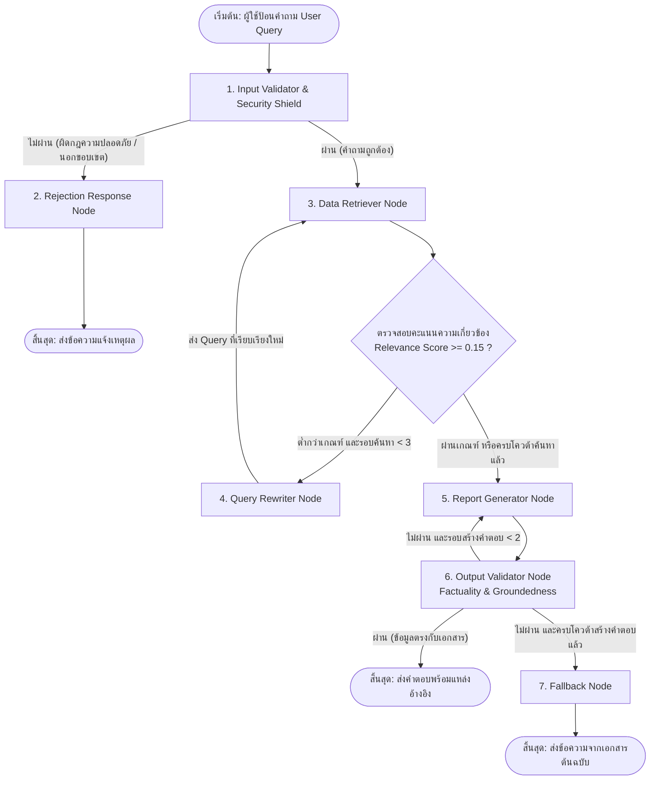
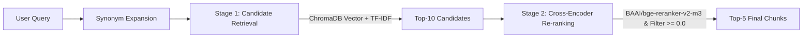

# เอกสารอธิบายสถาปัตยกรรมและการทำงานของระบบ RAG_BBL

---

## สารบัญ
1. [ภาพรวมของระบบ](#1-ภาพรวมของระบบ)
2. [แผนภาพสถาปัตยกรรม](#2-แผนภาพสถาปัตยกรรม)
3. [การจัดการข้อมูลและการแบ่งท่อน (Chunking)](#3-การจัดการข้อมูลและการแบ่งท่อน-chunking)
4. [ระบบค้นหาและจัดอันดับ (Two-Stage Retrieval)](#4-ระบบค้นหาและจัดอันดับ-two-stage-retrieval)
5. [การควบคุมกระบวนการทำงาน (LangGraph Multi-Agent)](#5-การควบคุมกระบวนการทำงาน-langgraph-multi-agent)
6. [ระบบความปลอดภัยและการตรวจสอบคุณภาพ (Guardrails)](#6-ระบบความปลอดภัยและการตรวจสอบคุณภาพ-guardrails)
7. [การสร้างคำตอบและการจัดรูปแบบผลลัพธ์](#7-การสร้างคำตอบและการจัดรูปแบบผลลัพธ์)
8. [การทดสอบและการวัดผล](#8-การทดสอบและการวัดผล)
9. [โครงสร้างโปรเจกต์](#9-โครงสร้างโปรเจกต์)

---

## 1. ภาพรวมของระบบ

ระบบ RAG_BBL พัฒนาขึ้นสำหรับตอบคำถามเกี่ยวกับระเบียบนโยบายภายในองค์กร (15 หมวดหมู่) เช่น นโยบายการเดินทาง, การทำงานจากที่พักอาศัย, การลา, การเบิกจ่าย, ความปลอดภัยไอที, PDPA และ AML/KYC 

### องค์ประกอบหลักทางเทคนิค
- **Multi-Agent Workflow:** ควบคุมลำดับการทำงานด้วย LangGraph แบบ Cyclic Graph พร้อมลูปแก้ไขคำค้นหาอัตโนมัติ
- **Two-Stage Retrieval:** ดึงข้อมูลรอบแรกด้วย ChromaDB (Dense) + TF-IDF (Sparse) แล้วจัดอันดับซ้ำด้วย Cross-Encoder (`bge-reranker-v2-m3`)
- **Security & Safety Guardrails:** ป้องกัน Prompt Injection, Mask ข้อมูลส่วนบุคคล (PII), กรองโค้ดอันตราย และจำกัดความถี่การเรียกใช้งาน
- **LLM Support:** รองรับ DeepSeek API และ Azure APIM Gateway ผ่าน Factory Pattern

---

## 2. แผนภาพสถาปัตยกรรม



---

## 3. การจัดการข้อมูลและการแบ่งท่อน (Chunking)

### 3.1 เนื้อหาในเอกสารอ้างอิง (`knowledge_base.txt`)
เอกสารมีทั้งหมด 15 หมวดหมู่ โดยแบ่งด้วย Header อย่างชัดเจน:

| หมวด | หัวข้อนโยบาย | สาระสำคัญ |
|:---:|:---|:---|
| 1 | International Travel | ขออนุมัติล่วงหน้า 30 วัน, เบิกตั๋ว Economy, ส่งรายงานใน 14 วัน |
| 2 | Remote Work | WFH สูงสุด 3 วัน/สัปดาห์, Core Hours 10:00-15:00, บังคับใช้ VPN |
| 3 | Annual Leave | สะสม 1.5 วัน/เดือน, ยกยอดข้ามปีได้ 5 วัน, แจ้งล่วงหน้า 14 วัน |
| 4 | Expense Reimbursement | ใบเสร็จเกิน $25, ส่งเบิกใน 30 วัน, วงเงินอนุมัติผู้จัดการไม่เกิน $500 |
| 5 | Code of Conduct | การรับของขวัญไม่เกิน $50, ห้ามรับเงินสด, การรักษาความลับ |
| 6 | IT Security | รหัสผ่าน 12 ตัวอักษร เปลี่ยนทุก 90 วัน, 2FA, ติดตั้ง MDM บนอุปกรณ์ |
| 7 | Data Privacy & PDPA | การประมวลผลข้อมูลตามกฎหมาย, แจ้งเตือนเหตุรั่วไหลใน 72 ชม. |
| 8 | Health & Benefits | ประกันสุขภาพ IPD/OPD 30 ครั้ง/ปี, ทันตกรรม $500, EAP 24/7 |
| 9 | AML & KYC | ตรวจสอบลูกค้ากลุ่มเสี่ยง (CDD/EDD), รายงาน STR ใน 24 ชม. |
| 10 | Performance & Promotion | ประเมิน KPI รอบ ก.ค. และ ธ.ค., เกณฑ์คะแนน 1-5, แผน PIP 90 วัน |
| 11 | Workplace Health & Safety | ซ้อมหนีไฟปีละ 2 ครั้ง, รายงานอุบัติเหตุใน 24 ชม., ตรวจอุปกรณ์ Ergonomic |
| 12 | Whistleblowing | ช่องทางแจ้งเบาะแสลับ, มาตรการคุ้มครองผู้แจ้งเบาะแส |
| 13 | Intellectual Property | ทรัพย์สินทางปัญญาเป็นขององค์กร, การขอใช้อนุญาต Open Source |
| 14 | Learning & Development | งบอบรม $1,500/คน/ปี, ลาเพื่อสอบใบรับรอง 3 วัน/ปี |
| 15 | Severance & Offboarding | แจ้งลาออกล่วงหน้า 30-60 วัน, การคืนอุปกรณ์, การจ่ายเงินชดเชย |

### 3.2 การแบ่งท่อนข้อความ (Chunking)
- **Primary Split:** แบ่งตามย่อหน้า (`\n\n`) เพื่อรักษาใจความของแต่ละข้อกำหนด
- **Secondary Split:** หากย่อหน้ายาวเกิน `chunk_size` (500 ตัวอักษร) จะตัดแบ่งตามขอบเขตประโยค เพื่อไม่ให้ข้อความขาดตอน

---

## 4. ระบบค้นหาและจัดอันดับ (Two-Stage Retrieval)



### รายละเอียดแต่ละขั้นตอน
1. **Synonym Expansion:** แปลงคำภาษาพูดหรือคำย่อเป็นคำทางการ เช่น `WFH` $\rightarrow$ `remote work`, `vacation` $\rightarrow$ `annual leave`
2. **Stage 1 (Recall):** ดึง Chunks เบื้องต้น 10 รายการด้วย ChromaDB (`multilingual-e5-small`) หรือ TF-IDF
3. **Stage 2 (Precision & Noise Filtering):** นำคำถามและ Candidate Chunks มาจับคู่ส่งเข้าโมเดล Cross-Encoder `BAAI/bge-reranker-v2-m3` เพื่อคำนวณคะแนน Raw Logit และตัด Chunk ขยะที่คะแนนติดลบ ($< 0.0$) ทิ้ง ก่อนคัดเลือกเฉพาะ Top-5 อันดับแรก
4. **Fallback:** หากโหลด Re-ranker ไม่สำเร็จ ระบบจะส่งผลลัพธ์จาก Stage 1 ต่อไปโดยอัตโนมัติ

---

## 5. การควบคุมกระบวนการทำงาน (LangGraph Multi-Agent)

### 5.1 โครงสร้างข้อมูลกลาง (`AgentState`)
ข้อมูลที่ส่งต่อระหว่าง Node กำหนดเป็น `TypedDict` ใน `agents/state.py`:

```python
class AgentState(TypedDict, total=False):
    query: str                          # คำถามของผู้ใช้
    expanded_query: str                 # คำค้นหาหลังแปลงคำพ้องหรือ Rewrite
    is_valid: bool                      # สถานะการตรวจสอบความถูกต้องของคำถาม
    rejection_reason: str               # เหตุผลการปฏิเสธคำถาม
    retrieved_documents: List[Dict]     # Chunks เอกสารที่ดึงมาได้
    retrieval_score: float              # คะแนนความเกี่ยวข้องถ่วงน้ำหนัก (Weighted-Average Raw Logit)
    retrieval_attempts: int             # จำนวนรอบที่ค้นหา
    generated_report: str               # ข้อความคำตอบที่สร้างขึ้น
    is_grounded: bool                   # ผลการตรวจจับความถูกต้องเทียบกับเอกสาร
    generation_attempts: int            # จำนวนรอบที่พยายามสร้างคำตอบ
    final_answer: str                   # คำตอบสุดท้ายสำหรับส่งให้ผู้ใช้
    error: str                          # ข้อความข้อผิดพลาด (ถ้ามี)
```

### 5.2 บทบาทของแต่ละ Node
| Node | หน้าที่ |
|:---|:---|
| `input_validator` | ตรวจสอบความปลอดภัย (Security Shield), ความยาว และความเกี่ยวข้องกับนโยบาย |
| `rejection_response` | คืนข้อความปฏิเสธตามสาเหตุ เช่น นอกขอบเขต หรือคำสั่งไม่ปลอดภัย |
| `retriever` | ดึง Chunks จากคลังความรู้ตามค่า Top-K และคำนวณคะแนนความเกี่ยวข้องถ่วงน้ำหนัก Top-K |
| `query_rewriter` | เรียบเรียงคำค้นหาใหม่เมื่อคะแนนความเกี่ยวข้องต่ำกว่า 0.15 |
| `generator` | สรุปคำตอบตามโครงสร้าง 4 ส่วน พร้อมระบุแหล่งอ้างอิง |
| `output_validator` | ตรวจสอบความถูกต้องของคำตอบเทียบกับเอกสารอ้างอิง (Factuality) และ Mask PII ขาออก |
| `max_attempts_fallback` | คืนข้อความจากเอกสารต้นฉบับเมื่อสร้างคำตอบไม่สำเร็จครบตามจำนวนรอบที่กำหนด |

---

## 6. ระบบความปลอดภัยและการตรวจสอบคุณภาพ (Guardrails)

### รายการ Guardrails ตามมาตรฐาน OWASP LLM Top 10

| หมวดหมู่ | กลไกการทำงาน |
|:---|:---|
| **Prompt Injection & Jailbreak** | ตรวจจับคำสั่งลบล้างกฎ เช่น *"Ignore previous instructions"*, *"DAN Mode"*, *"ลืมกฎทั้งหมด"* |
| **System Prompt Protection** | บล็อกคำขอที่พยายามดึง System Prompt หรือคำสั่งตั้งต้นของระบบ |
| **PII Masking (เข้า/ออก)** | แทนที่เลขบัตรประชาชน (13 หลัก), บัตรเครดิต (16 หลัก), เบอร์โทร, อีเมล, และ API Key ด้วย Tag |
| **Code & SQL Injection** | กรองแท็ก `<script>`, คำสั่ง SQL (`DROP TABLE`, `UNION SELECT`) และคำสั่ง Shell |
| **Rate Limiter** | จำกัดความถี่ไม่เกิน 30 requests/minute ต่อ Session แบบ Sliding Window |
| **Input Check สองระดับ** | ตรวจความคล้ายคลึงด้วย TF-IDF ก่อน (<5ms) หากไม่แน่ใจจึงส่งให้ LLM ตัดสิน |
| **Context Window Control** | คำนวณจำนวน Token ด้วย `tiktoken` และตัดทอนเนื้อหาส่วนเกินก่อนส่งเข้า LLM |

---

## 7. การสร้างคำตอบและการจัดรูปแบบผลลัพธ์

ข้อกำหนดใน System Prompt ของ Report Generator:
1. ตอบโดยใช้ข้อมูลจาก Chunks ที่ได้รับเท่านั้น
2. จัดรูปแบบคำตอบให้เข้าใจง่าย แบ่งเป็น 4 ส่วน: สรุปใจความ, เงื่อนไขสำคัญ, ข้อควรระวัง, และแหล่งอ้างอิง
3. ระบุเลขหมวดนโยบาย (Citation) ทุกครั้ง
4. ตรวจจับภาษาของคำถามอัตโนมัติ (ถามภาษาไทยตอบภาษาไทย, ถามภาษาอังกฤษตอบภาษาอังกฤษ)

---

## 8. การทดสอบและการวัดผล

### 8.1 การทดสอบอัตโนมัติ (Pytest)
มีชุดทดสอบทั้งหมด **57 Test Cases** ในไดเรกทอรี `tests/` รันแบบ Offline โดย Mock การเรียกใช้งาน LLM:
- `test_config.py` (7 tests): โหลดค่าคอนฟิก, สลับ Provider, จัดการ Token, Mock APIM
- `test_reranker.py` (5 tests): Two-stage scoring, Sigmoid normalization, Fallback
- `test_search.py` (8 tests): TF-IDF, ChromaDB, Synonym Expansion, Chunking
- `test_guardrails.py` (8 tests): Input bounds, Off-topic detection, Fact-checking
- `test_security_guardrails.py` (25 tests): PII, Jailbreak, Injection, Rate Limiter
- `test_integration.py` (4 tests): StateGraph Workflow ทั้งหมด

### 8.2 การวัดผลเชิงปริมาณ (`evaluate.py`)
ทดสอบกับชุดข้อมูลมาตรฐาน `evaluation/golden_dataset.json` จำนวน 20 คำถาม:
- **Context Recall @ Top-K:** $\ge 85\%$
- **Factual Groundedness:** $\ge 90\%$
- **Guardrail Catch Rate:** $100\%$
- **Average Latency:** $< 10$ วินาที

---

## 9. โครงสร้างโปรเจกต์

```text
RAG_BBL/
├── main.py                             # จุดเริ่มต้นโปรแกรม CLI
├── gradio_app.py                       # Web UI (Gradio, port 7861)
├── evaluate.py                         # สคริปต์รัน Benchmark
├── config.yaml                         # ค่าคอนฟิกหลักของระบบ
├── knowledge_base.txt                  # เอกสารนโยบาย 15 หมวดหมู่
├── TESTING.md                          # เอกสารอธิบายชุดการทดสอบ
├── requirements.txt                    # รายการไลบรารี
├── Dockerfile                          # Docker build definition
├── docker-compose.yml                  # Docker orchestration
├── .env.example                        # ตัวอย่างไฟล์ตั้งค่า API Key
│
├── agents/                             # โมดูล LangGraph Agents
│   ├── state.py                        # AgentState TypedDict
│   ├── retriever.py                    # Retriever & Query Rewriter
│   ├── generator.py                    # Generator & Fallback Nodes
│   └── graph.py                        # StateGraph Construction
│
├── tools/                              # เครื่องมือค้นหาและจัดอันดับ
│   └── search.py                       # Search Engine (ChromaDB, TF-IDF, BGE Reranker)
│
├── guardrails/                         # ระบบความปลอดภัย
│   ├── security_shield.py              # OWASP LLM Guardrails & PII Masking
│   ├── input_validator.py              # ตรวจสอบคำถามขาเข้า
│   └── output_validator.py             # ตรวจสอบความถูกต้องของคำตอบ
│
├── config/                             # จัดการคอนฟิกและโมเดล
│   └── settings.py                     # Factory สำหรับ DeepSeek และ Azure APIM
│
├── prompts/                            # System Prompt Templates
│   ├── retriever_system.txt
│   ├── generator_system.txt
│   ├── input_validator_prompt.txt
│   └── output_validator_prompt.txt
│
├── evaluation/                         # ชุดข้อมูลและตัวประเมินผล
│   ├── golden_dataset.json             # Benchmark Dataset 20 ข้อ
│   ├── evaluation_report.json          # รายงานผลการประเมิน
│   └── metrics.py                      # ตัวคำนวณคะแนน
│
└── tests/                              # ชุดทดสอบ Pytest 57 ข้อ
    ├── conftest.py
    ├── test_config.py
    ├── test_reranker.py
    ├── test_search.py
    ├── test_guardrails.py
    ├── test_integration.py
    └── test_security_guardrails.py
```
